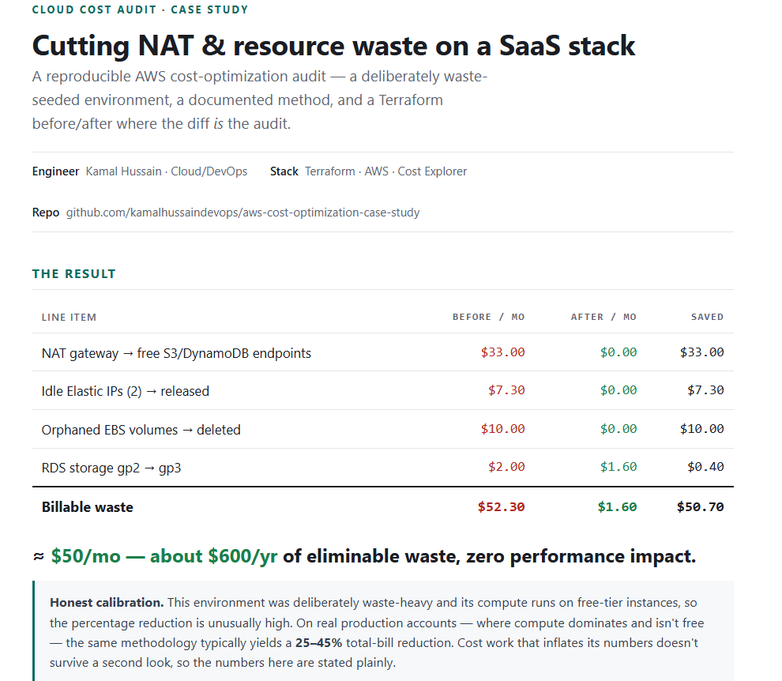
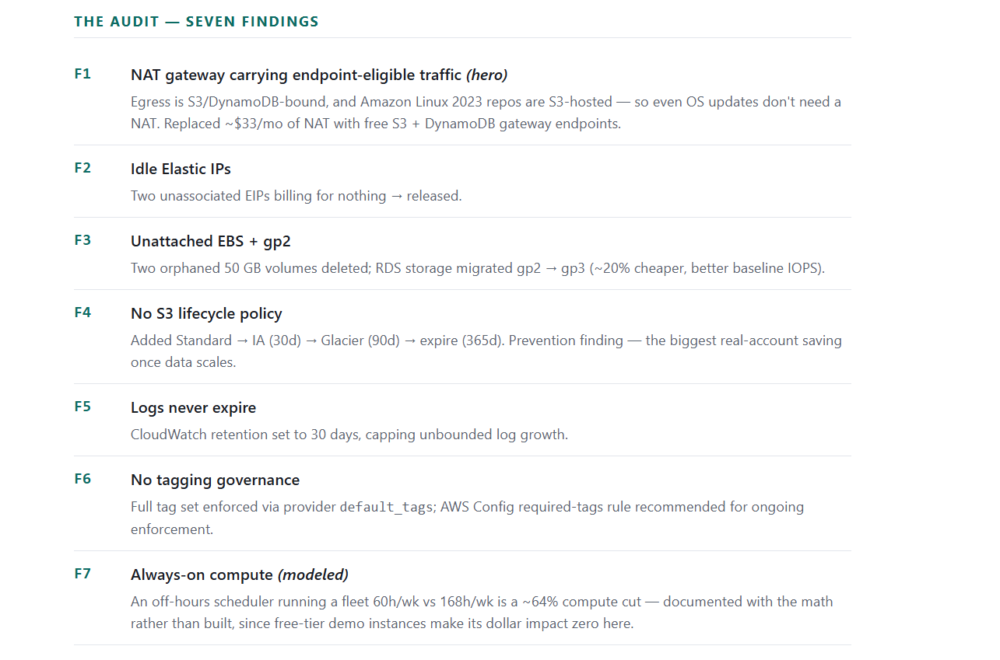
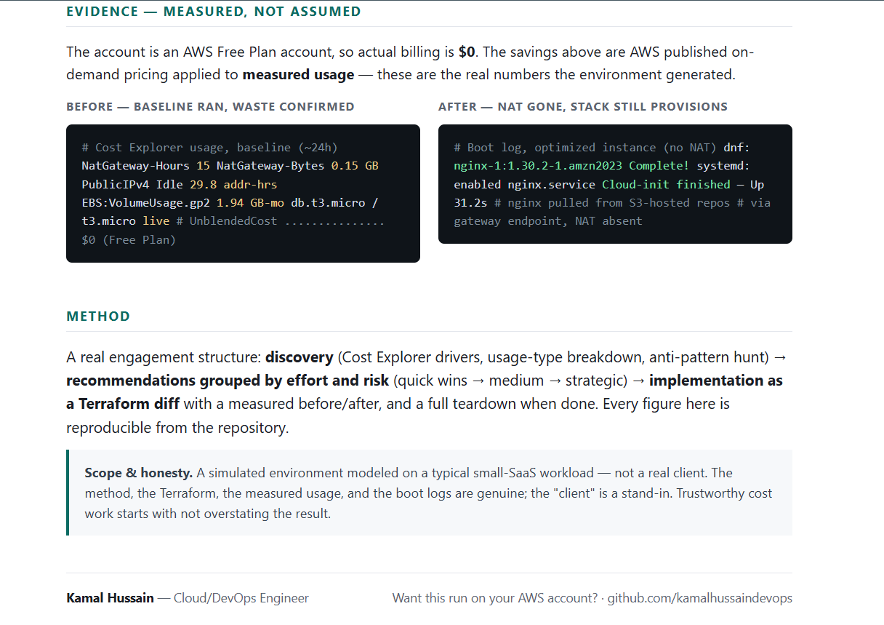
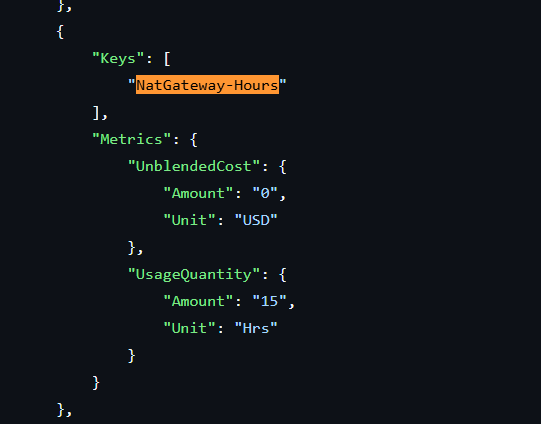
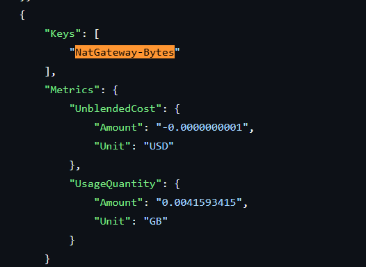
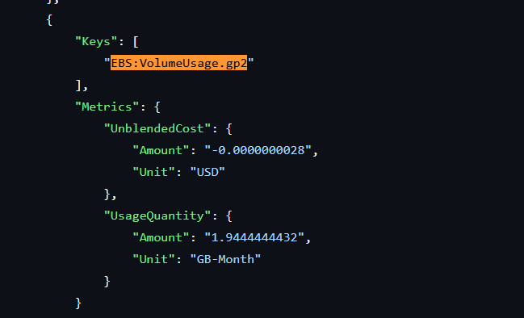
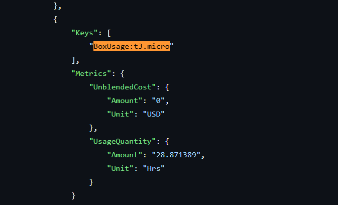

# AWS Cost Optimization — A Reproducible Audit (NAT → Endpoints, ~$600/yr eliminated)

A hands-on AWS cost-optimization audit demonstrated on a **simulated small-SaaS
environment**, deliberately seeded with common waste. The repo ships the full
**Terraform diff** between the wasteful "before" and the optimized "after" — the
diff *is* the audit — plus a documented methodology and the savings math behind
every fix.

**Stack:** Terraform · AWS (VPC, EC2, RDS, NAT Gateway, VPC Endpoints, S3, CloudWatch, IAM) · Cost Explorer

---

## The Result



**~$50/mo (~$600/yr) of eliminable waste removed with zero performance impact.**

> **Honest calibration:** this environment was deliberately waste-heavy and its
> compute runs on free-tier instances, so the percentage reduction is unusually
> high. On real production accounts — where compute dominates and isn't free — this
> same methodology typically yields a **25–45%** total-bill reduction. Cost work
> that inflates its numbers doesn't survive a CTO's second look, so the numbers here
> are stated plainly.

---

## The Audit — Seven Findings



1. **F1 — NAT gateway (hero):** the workload's egress is S3/DynamoDB-bound, and
   Amazon Linux 2023's package repos are S3-hosted — so even OS updates don't need
   a NAT. Replaced ~$33/mo of NAT with **free S3 + DynamoDB gateway endpoints**.
2. **F2 — Idle Elastic IPs:** two unassociated EIPs billing for nothing → released.
3. **F3 — Unattached EBS + gp2:** two orphaned 50GB volumes deleted; RDS storage
   migrated gp2 → gp3.
4. **F4 — No S3 lifecycle:** added Standard → IA (30d) → Glacier (90d) → expire (365d).
5. **F5 — Logs never expire:** CloudWatch retention set to 30 days.
6. **F6 — No tagging governance:** full tag set enforced via provider `default_tags`;
   AWS Config required-tags rule recommended for ongoing enforcement.
7. **F7 — Always-on compute (modeled):** an off-hours scheduler running a fleet
   60h/wk instead of 168h/wk is a ~64% compute cut — documented with the math
   rather than built, since the free-tier demo instances make its dollar impact zero here.

---

## Evidence — Measured, Not Assumed



The account is an AWS Free Plan account, so actual billing is **$0**. The savings
above are AWS published on-demand pricing applied to **measured usage** — these
are the real numbers the environment generated.

### Measured Usage (Cost Explorer API, baseline ~24h)

| Usage Type | Measured | Unit | On-Demand Rate | Projected Monthly |
|---|---:|---|---:|---:|
| NatGateway-Hours | 15.00 | Hrs | $0.045/hr | **$33.00** |
| NatGateway-Bytes | 0.15 | GB | $0.045/GB | varies |
| PublicIPv4 IdleAddress | 29.83 | addr-hrs | $0.005/hr | **$7.30** |
| EBS:VolumeUsage.gp2 | 1.94 | GB-mo | $0.10/GB-mo | **$10.00** |
| BoxUsage:t3.micro | 28.87 | Hrs | free-tier | $0 |
| InstanceUsage:db.t3.micro | 14.83 | Hrs | free-tier | $0 |

### Raw Cost Explorer Evidence


| | |
|---|---|
|  |  |
|  |  |

Full JSON: [`docs/before-usage-and-cost.json`](docs/before-usage-and-cost.json)


---

## What's in This Repo

| Path | What it is |
|---|---|
| `baseline/` | Terraform for the deliberately wasteful environment (the "before") |
| `optimized/` | The same environment, fixed (the "after") |
| `audit/findings.md` | The methodology and all seven findings with savings math |
| `docs/case-study.html` | Print-ready case study (open in browser → Print → Save as PDF) |
| `docs/AWS-Cost-Audit-Checklist.md` | Reusable 28-point audit checklist |
| `docs/` | Measured usage evidence, boot logs, and screenshots |

## Methodology

A real engagement structure: **discovery** (Cost Explorer top drivers, usage-type
breakdown, anti-pattern hunt) → **recommendations grouped by effort and risk**
(quick wins → medium → strategic) → **implementation as a Terraform diff** with a
measured before/after.

## Reproduce It

```bash
cd baseline   # or optimized
terraform init
terraform plan
terraform apply
```

> **Cost discipline:** set an AWS Budget with alerts *before* applying, and run
> `terraform destroy` when done — teardown is part of the engagement, not an
> afterthought. The baseline and optimized states reuse the same resource names, so
> only one can be live at a time.

## A Note on Honesty

This is a simulated environment, not a real client. The method, the Terraform,
the measured usage data, and the optimized boot logs are genuine. Billing ran $0
on an AWS Free Plan account, so savings are AWS published pricing applied to
measured usage. The "client" is a stand-in for a typical small-SaaS workload.
Said plainly because trustworthy cost work starts with not overstating the result.

---

**Kamal Hussain** — Cloud/DevOps Engineer · [Want this run on your AWS account?](https://github.com/kamalhussaindevops)
